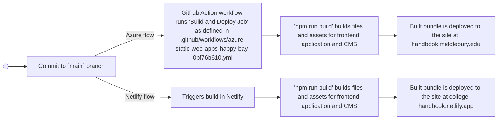

# Middlebury College Handbook

## Requirements

* [Node.js](https://nodejs.org/) ^24.14.1
* [Gatsby CLI](https://www.gatsbyjs.com/docs/tutorial/getting-started/part-0/#gatsby-cli) - Install the Gatsby CLI globally by running the command below:

```shell
npm install -g gatsby-cli
```

## Start developing

Clone the repo and install node dependencies:

```shell
npm install
```

Navigate into the site’s directory and start it up:

```shell
cd college-handbook/
npm start
```

If the project fails to start due to errors run:

```shell
npm run clean
npm start
```

To compile the site for production so it can be deployed:

```shell
npm run build
```

To serve the production build of the site for testing prior to deployment:

```shell
npm run serve
```

## Contributing to the project 

Look at CONTRIBUTING.md for instructions on how to add new pages to the handbook. 

## Project Setup
This project uses [GatsbyJS](https://www.gatsbyjs.com/front-end-framework/) and [Decap CMS](https://decapcms.org/). The built assets are served as an Azure site at handbook.middlebury.edu. 

The built files and assets are also served through Netlify at [college-handbook.netlify.app](https://college-handbook.netlify.app), in order to take advantage of the built-in authentication service called [Identity](https://docs.netlify.com/manage/security/secure-access-to-sites/identity/overview/). It allows for easy management of users for this application.
To manage the college handbook site in Netlify go to app.netlify.com and login using the webaster@middlebury.edu account.

The CMS can be accessed at [college-handbook.netlify.app/admin](https://college-handbook.netlify.app/admin/). 

## Build Workflow


